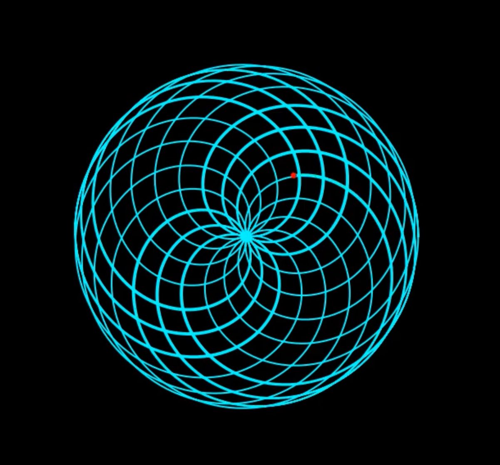

# Euler's Spiral of Pi

This piece visualizes the function:

\[
z(θ) = e^{iθ} + e^{iπθ}
\]

It represents the harmonic interference of two rotating vectors. One spins with angle θ, and the other spins π times faster. Their sum forms a mesmerizing spiral pattern.

## 🎥 Preview

[▶️ Watch the animation](spiral_pi_animation.mp4)

## 🧠 Tech Stack

- Python 3
- NumPy
- Matplotlib
- FFmpeg (for saving .mp4)

## 🧑‍🎨 Artist

**Ashtazit Kast**  
*"Essence of Eight, Cast into Form"*

This is the first piece in the **Generative Math Art** series.
